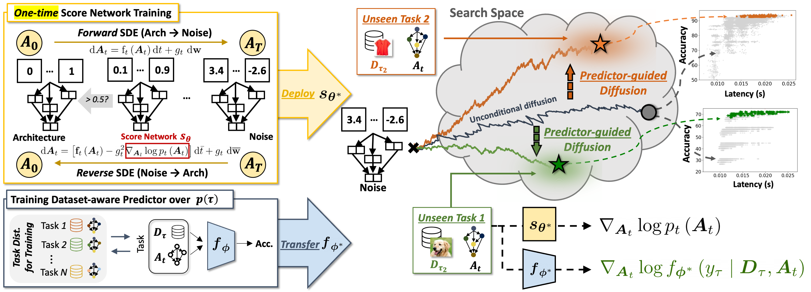

# DiffusionNAG: Predictor-guided Neural Architecture Generation with Diffusion Models

Official Code Repository for the paper [DiffusionNAG: Predictor-guided Neural Architecture Generation with Diffusion Models](https://arxiv.org/abs/2305.16943).




## Why DiffusionNAG?

+ Existing NAS approaches still result in large waste of time as they need to explore an extensive search space and the property predictors mostly play a passive role such as the evaluators that rank architecture candidates provided by a search strategy to simply filter them out during the search process.

+ We introduce a novel predictor-guided **Diffusion**-based **N**eural **A**rchitecture **G**enerative framework called **DiffusionNAG**, which explicitly incorporates the predictors into generating architectures that satisfy the objectives.

+ DiffusionNAG offers several advantages compared with conventional NAS methods, including efficient and effective search, superior utilization of predictors for both NAG and evaluation purposes, and easy adaptability across diverse tasks.


## Environment Setup

Create environment with **Python 3.7.2** and **Pytorch 1.13.1**. 
Use the following command to install the requirements:

```
cd setup
conda create -n diffusionnag python==3.7.2
conda activate diffusionnag
bash install.sh
```

## Run - NAS-Bench-201
### Download datasets, preprocessed datasets, and checkpoints
```
cd NAS-Bench-201
```

If you want to run experiments on datasets that are not included in the benchmark, such as "aircraft" or "pets", you will need to download the raw dataset for actually trainining neural architectures on it:
```
## Download the raw dataset
bash script/download_raw_dataset.sh [DATASET]
```

We use dataset encoding when training the meta-predictor or performing conditional sampling with the target dataset. To obtain dataset encoding, you need to download the preprocessed dataset:
```
## Download the preprocessed dataset
bash script/download_preprocessed_dataset.sh
```

If you want to use the pre-trained score network or meta-predictor, download the checkpoints from the following links.

Download the pre-trained score network and move the checkpoint to ```checkpoints/scorenet``` directory:
+ https://drive.google.com/file/d/1-GnItyf03-2r_KbYV3PCHS1FNVFXlNR3/view?usp=sharing

Download the pre-trained meta-predictor and move the checkpoint to ```checkpoints/meta_surrogate``` directory:
+ https://drive.google.com/file/d/1oFXSLBPvorO_Ar-1JQQB49x7L1BX79gd/view?usp=sharing
+ https://drive.google.com/file/d/1S2IV6L9t6Hlhh6vGsQkyqMJGt5NnJ8pj/view?usp=sharing

### Transfer NAG
```
bash script/transfer_nag.sh [GPU] [DATASET]
## Examples
bash script/transfer_nag.sh 0 cifar10
bash script/transfer_nag.sh 0 cifar100
bash script/transfer_nag.sh 0 aircraft
bash script/transfer_nag.sh 0 pets
```

### Train score network
```
bash script/tr_scorenet.sh [GPU]
```

### Train meta-predictor
```
bash script/tr_meta_surrogate.sh [GPU]
```


## Run - MobileNetV3
### Download datasets, preprocessed datasets, and checkpoints
```
cd MobileNetV3
```

If you want to run experiments on datasets that are not included in the benchmark, such as "aircraft" or "pets", you will need to download the raw dataset for actually trainining neural architectures on it:
```
## Download the raw dataset
bash script/download_raw_dataset.sh [DATASET]
```

We use dataset encoding when training the meta-predictor or performing conditional sampling with the target dataset. To obtain dataset encoding, you need to download the preprocessed dataset:
```
## Download the preprocessed dataset
bash script/download_preprocessed_dataset.sh
```

If you want to use the pre-trained score network or meta-predictor, download the checkpoints from the following links.

Download the pre-trained score network and move the checkpoint to ```checkpoints/ofa/score_model``` directory:
+ https://www.dropbox.com/scl/fi/r47svpl1tvpm9tos3vtsd/model_best.pth.tar?rlkey=5wpa6zh8cpp4gctuol25wxj0u&dl=0

Download the first pre-trained meta-predictor and move the checkpoint to ```checkpoints/ofa/noise_aware_meta_surrogate``` directory:
+ https://www.dropbox.com/scl/fi/k896bi61pu0rq87p5argx/model_best.pth.tar?rlkey=qo4ga96c5a3fu4228nnvift6v&dl=0

Download the second pre-trained meta-predictor and move the checkpoint to ```checkpoints/ofa/unnoised_meta_surrogate_from_metad2a``` directory:
+ https://www.dropbox.com/scl/fi/zfdis3njlfa1g5nsje3h8/ckpt_max_corr.pt?rlkey=1vplo2oiilljv6991ub0a50sb&dl=0

Download the config file for TransferNAG experiments and move the checkpoint to ```configs``` directory:
+ https://www.dropbox.com/scl/fi/psv7lh4bijwapj5jkgaq3/transfer_nag_ofa.pt?rlkey=wi15mjvme2pmep7p12auvm1ie&dl=0
  
### Transfer NAG
```
bash script/transfer_nag.sh [GPU] [DATASET]
## Examples
bash script/transfer_nag.sh 0,1 cifar10
bash script/transfer_nag.sh 0,1 cifar100
bash script/transfer_nag.sh 0,1 aircraft
bash script/transfer_nag.sh 0,1 pets
```

### Train score network
```
bash script/tr_scorenet_ofa.sh [GPU]
```

### Train meta-predictor
```
bash script/tr_meta_surrogate_ofa.sh [GPU]
```


## Citation

If you have found our work helpful for your research, we would appreciate it if you could acknowledge it by citing our work.

```BibTex
@inproceedings{
an2024diffusionnag,
title={Diffusion{NAG}: Predictor-guided Neural Architecture Generation with Diffusion Models},
author={Sohyun An and Hayeon Lee and Jaehyeong Jo and Seanie Lee and Sung Ju Hwang},
booktitle={The Twelfth International Conference on Learning Representations},
year={2024},
url={https://openreview.net/forum?id=dyG2oLJYyX}
}
```
